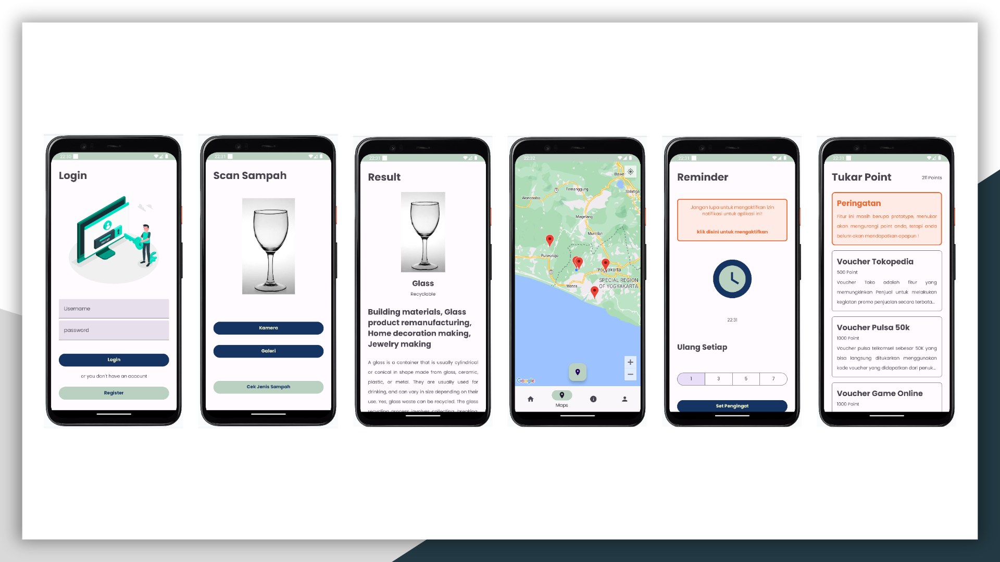

# 📑About Our Project
ASAH (Aplikasi Sortir Sampah) is an application aimed at encouraging the community to manage waste in an appropriate manner and provides rewards when users successfully manage their waste correctly. In our application, users are required to sort their waste first, and then they can dispose of or donate their waste to recycling agencies in their vicinity.

# Preview of ASAH (Aplikasi Sortir Sampah) - Bangkit Capstone Project 2023
  
# The Team

|            Member           | Student ID |        Path        |        Contacts        |
| :-------------------------: | :--------: | :----------------: | :-----------------------------------------------------------------------------------------------------------------: |
| Edwin Mahendra        | M222DSX0118 |  Machine Learning  |           [LinkedIn](https://www.linkedin.com/in/edwin-mahendra/) or [Github](https://github.com/edwinmahendra)           |
| Johannes Baptista Adiatmaja Pambudi    | M222DSX1529 |  Machine Learning  |  [LinkedIn](https://www.linkedin.com/in/adiatmaja/) or [Github](https://github.com/adiatmaja)  |
| Zikri Kholifah Nur     | C360DSX0876 |   Cloud Computing  |   [LinkedIn](https://www.linkedin.com/in/zikrikn/) or [Github](https://github.com/zikrikn)            |
| Muhammad Fikri Raihan Ardiansyah | C360DSX3486 |   Cloud Computing  |  [LinkedIn](https://www.linkedin.com/in/fikriiardiansyahh/) or [Github](https://github.com/fikriiardiansyahh) |
| Irzan Luthfi Al Khalid    | A286DKX3839 | Mobile Development |  [LinkedIn](https://www.linkedin.com/in/irzanluthfi/) or [Github](https://github.com/Irzannn)             |
| Ridwan Ridlo Nugroho     | A286DSX0989 | Mobile Development |  [LinkedIn](https://www.linkedin.com/in/ridwan-ridlo-nugroho-617a10223/) or [Github](https://github.com/waniAEbro)    |

# Repositories

|   Learning Paths   |                                Link                                |
| :----------------: | :----------------------------------------------------------------: |
| 🤖 Machine Learning  |  [ML Repository](https://github.com/ASAH-Bangkit-2023/ML) |
| ☁️ Cloud Computing  |   [CC Repository](https://github.com/ASAH-Bangkit-2023/CC) |
| 📱 Mobile Development | [MD Repository](https://github.com/ASAH-Bangkit-2023/MD) |

Aye aye aye~  C23-PS225 Team 
